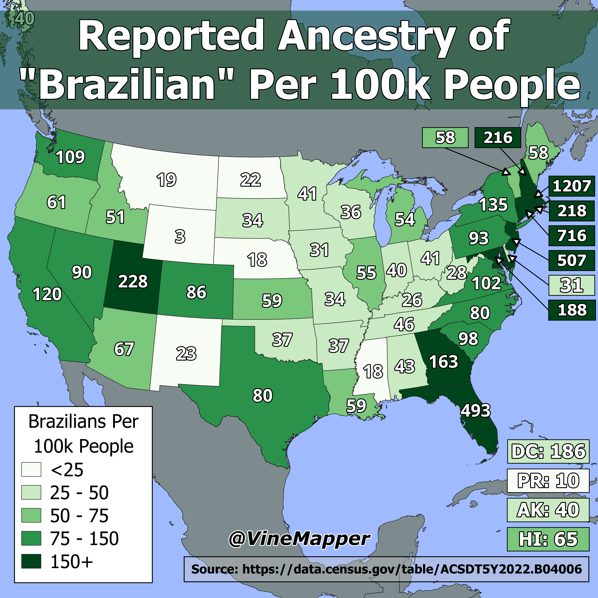

## Brazilians In the USA
A Simple Map showing the number of Brazilians per 100k people

## Data
* [Ethnic Data](https://data.census.gov/table/ACSDT5Y2022.B04006?q=People%20Reporting%20Ancestry&g=010XX00US$0400000)
* [State Boundaries](https://www.census.gov/geographies/mapping-files/time-series/geo/carto-boundary-file.html)
* [Great Lakes](https://usicecenter.gov/Products/GreatLakesData)
* [World GeoJSON](https://public.opendatasoft.com/explore/dataset/world-administrative-boundaries/export/?flg=en-us)

## Code
* [Jupyter Notebook](FormatData.ipynb)

## Posts
- [ ] [Tiktok]
- [ ] [Instagram]
- [ ] [Threads]
- [x] [Youtube Shorts](https://youtube.com/shorts/s6IPFurG0BU)
- [ ] [BlueSky]
- [ ] [Reddit r/Maps]
- [ ] [Reddit r/MapPorn]
