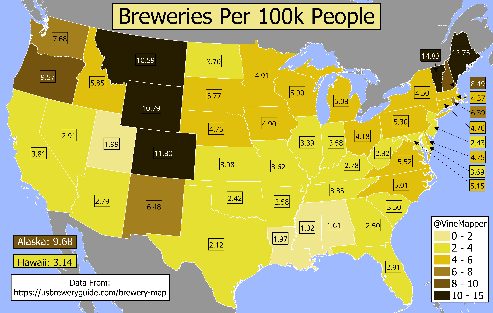

## Breweries Per Capita Per US State
A Simple Map showing the breweries per capita per each US State

## Data
* [Brewery Data](https://usbreweryguide.com/brewery-map)
* [State Population Totals](https://www.census.gov/data/tables/time-series/demo/popest/2020s-state-total.html)
* [State Boundaries](https://www.census.gov/geographies/mapping-files/time-series/geo/carto-boundary-file.html)
* [Great Lakes](https://usicecenter.gov/Products/GreatLakesData)

## Code
* [Jupyter Notebook](FormatData.ipynb)

## Posts
- [x] [Tiktok](https://www.tiktok.com/@vinemapper/video/7440602267780123935)
- [x] [Instagram](https://www.instagram.com/p/DCuu_62zZxH/)
- [x] [Threads](https://www.threads.net/@vinemapper/post/DCuvAd8zVqP)
- [x] [BlueSky](https://bsky.app/profile/vinemapper.bsky.social/post/3lbnhsdoexk2r)
- [x] [Reddit r/Maps](https://www.reddit.com/r/Maps/comments/1gyaqil/breweries_per_100k_people_2023_populations/)
- [x] [Reddit r/MapPorn](https://www.reddit.com/r/MapPorn/comments/1gz0wrg/breweries_per_100k_people/)