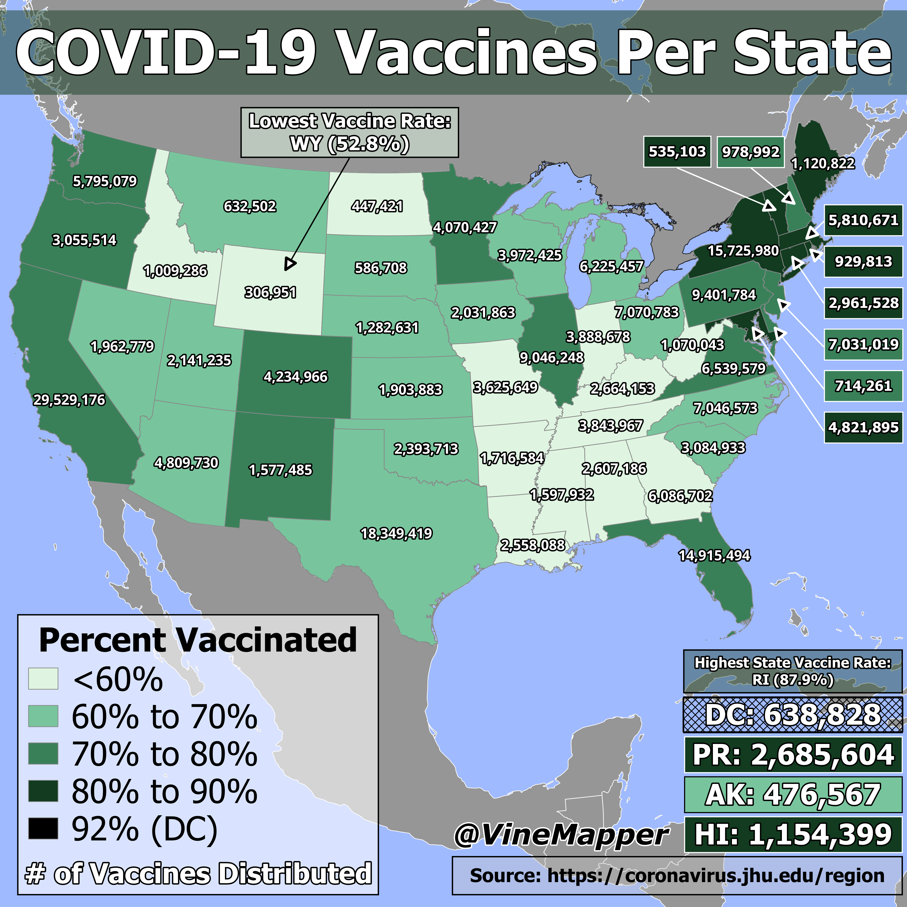

## COVID Vaccines Per State
A Simple Map showing the number of COVID-19 Vaccines and Vaccine Rates

## Data
* [COVID Data](https://coronavirus.jhu.edu/region)
* [State Boundaries](https://www.census.gov/geographies/mapping-files/time-series/geo/carto-boundary-file.html)
* [Great Lakes](https://usicecenter.gov/Products/GreatLakesData)
* [World GeoJSON](https://public.opendatasoft.com/explore/dataset/world-administrative-boundaries/export/?flg=en-us)

## Code
* [Jupyter Notebook](FormatData.ipynb)

## Posts
- [ ] [Tiktok]()
- [ ] [Instagram]()
- [ ] [Threads]()
- [ ] [Youtube Shorts]()
- [ ] [BlueSky]()
- [ ] [Reddit r/Maps]()
- [ ] [Reddit r/MapPorn]()
