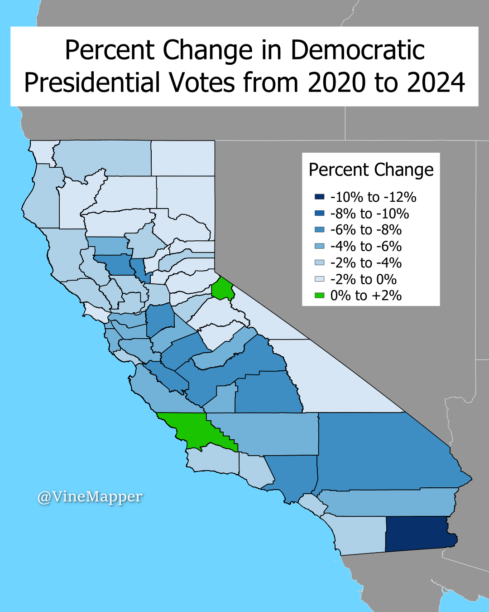

## Democratic Presidential Vote Changes From 2020 to 2024
A Simple Map showing the difference between 2020 and 2024 Democratic Presidential Voter Turnout in California (11/19/2024)

## Data
* [2020 Election Data](https://www.sos.ca.gov/elections/prior-elections/statewide-election-results/general-election-november-3-2020/statement-vote)
* [2024 Election Data](https://api-internal.sos.ca.gov/returns/maps/sorted/president)
* [California Counties](https://gis.data.ca.gov/datasets/CALFIRE-Forestry::california-county-boundaries/explore?location=32.666675%2C-118.940734%2C5.00)
* [Mexico Shapefile](https://data.humdata.org/dataset/cod-ab-mex?)

## Code
* [Jupyter Notebook](FormatData.ipynb)

## Posts
- [x] [Tiktok](https://www.tiktok.com/@vinemapper/video/7439483139795193119)
- [x] [Instagram](https://www.instagram.com/p/DCm7Km2zGVZ/)
- [x] [Threads](https://www.threads.net/@vinemapper/post/DCm7LFAzp5y)
- [x] [BlueSky](https://bsky.app/profile/vinemapper.bsky.social/post/3lbfxihww6k2d)
- [x] [Reddit r/MapPorn]()