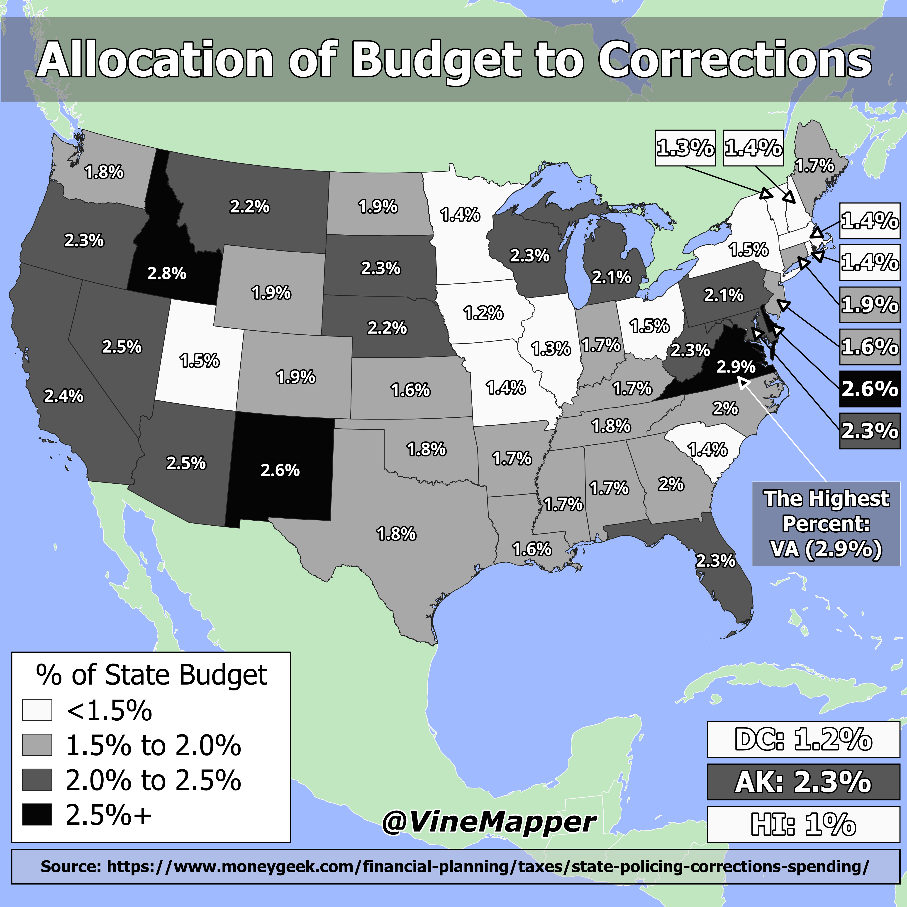

## Corrections Spending Per State Inversed
A Simple Map showing percent of state spending on corrections and amount per capita inversed from [Corrections_Spending_Per_Capita](../Corrections_Spending_Per_Capita/)

## Data
* [Corrections Data](https://www.moneygeek.com/financial-planning/taxes/state-policing-corrections-spending/)
* [State Boundaries](https://www.census.gov/geographies/mapping-files/time-series/geo/carto-boundary-file.html)
* [Great Lakes](https://usicecenter.gov/Products/GreatLakesData)
* [World GeoJSON](https://public.opendatasoft.com/explore/dataset/world-administrative-boundaries/export/?flg=en-us)

## Code
* [Jupyter Notebook](FormatData.ipynb)

## Posts
- [ ] [Tiktok](https://www.tiktok.com/@vinemapper/video/7446262829252119854)
- [ ] [Instagram](https://www.instagram.com/p/DDciU4IPU2R/)
- [ ] [Threads](https://www.threads.net/@vinemapper/post/DDciVTAvzZw)
- [ ] [Youtube Shorts](https://youtube.com/shorts/SnoXDH1NFP0)
- [ ] [BlueSky](https://bsky.app/profile/vinemapper.bsky.social/post/3ld2anrgwy22i)
- [ ] [Reddit r/Maps](https://www.reddit.com/r/Maps/comments/1hbyawe/corrections_spending_per_state/)
- [ ] [Reddit r/MapPorn]()
