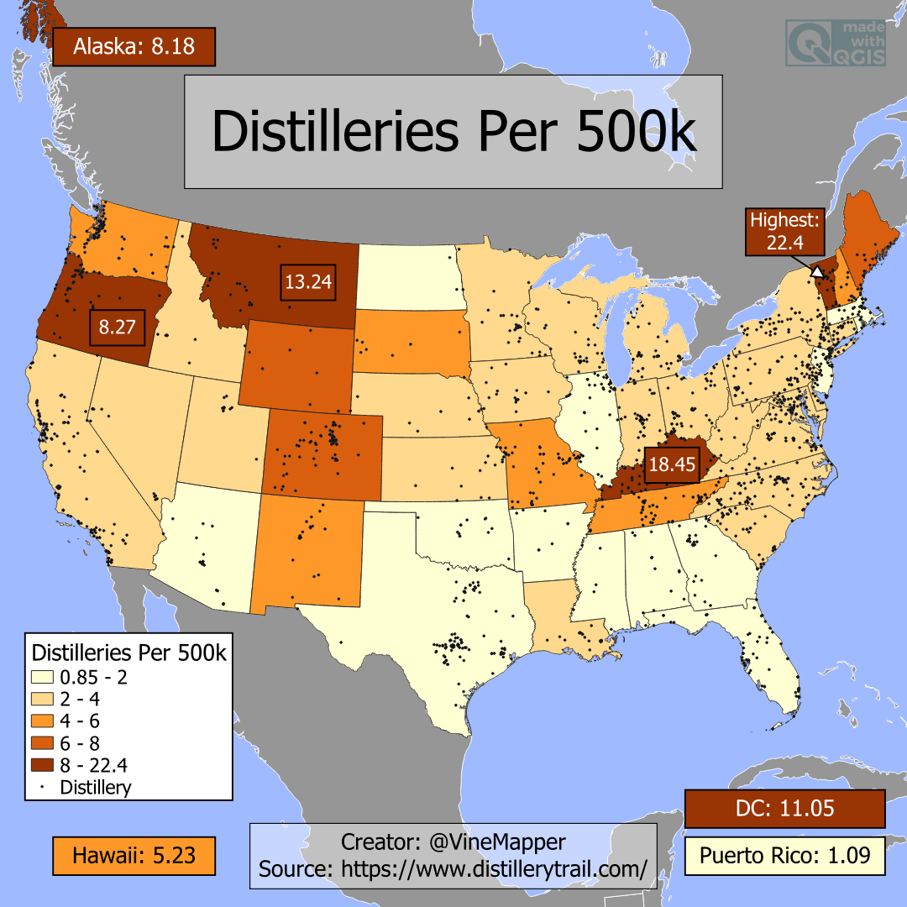

## Distilleries Per 500k
A Simple Map showing the Distilleries per 500k in each US State

## Data
* [Distillery Data](https://www.distillerytrail.com/)
* [State Population Totals](https://www.census.gov/data/tables/time-series/demo/popest/2020s-state-total.html)
* [State Boundaries](https://www.census.gov/geographies/mapping-files/time-series/geo/carto-boundary-file.html)
* [Great Lakes](https://usicecenter.gov/Products/GreatLakesData)

## Code
* [Jupyter Notebook](FormatData.ipynb)

## Posts
* [Tiktok]()
* [Instagram]()
* [Threads]()
* [BlueSky]()
* [Reddit]()