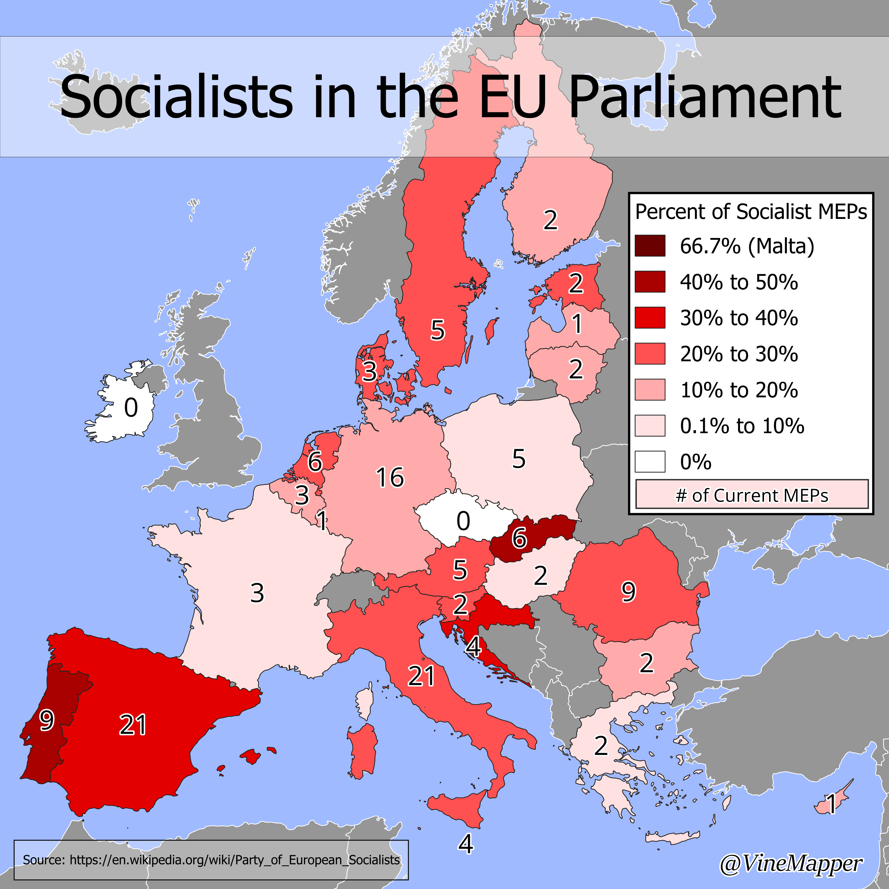

## Percent of Socialists in National Legislature
A Simple Map showing the percent of socialists in national legislature

## Data
* [From Previous Post -> GIS](https://github.com/winstonhoyle/VineMapper/blob/main/projects/European_Capitals_HDI/European_Capitals_HDI#Data)
* [Socialist Information](https://en.wikipedia.org/wiki/Party_of_European_Socialists)

## Code
* [Jupyter Notebook](FormatData.ipynb)

## Posts
- [x] [Tiktok](https://www.tiktok.com/@vinemapper/video/7440939041786203423)
- [x] [Instagram](https://www.instagram.com/p/DCxFq8aTGlu/)
- [x] [Threads](https://www.threads.net/@vinemapper/post/DCxFrhHzOll)
- [x] [BlueSky](https://bsky.app/profile/vinemapper.bsky.social/post/3lbptudz57k2y)
- [x] [Reddit r/Maps](https://www.reddit.com/r/Maps/comments/1gz04k0/socialists_in_the_eu_parliament/)
- [x] [Reddit r/MapPorn](https://www.reddit.com/r/MapPorn/comments/1gz1ps6/socialists_in_the_eu_parliament/)