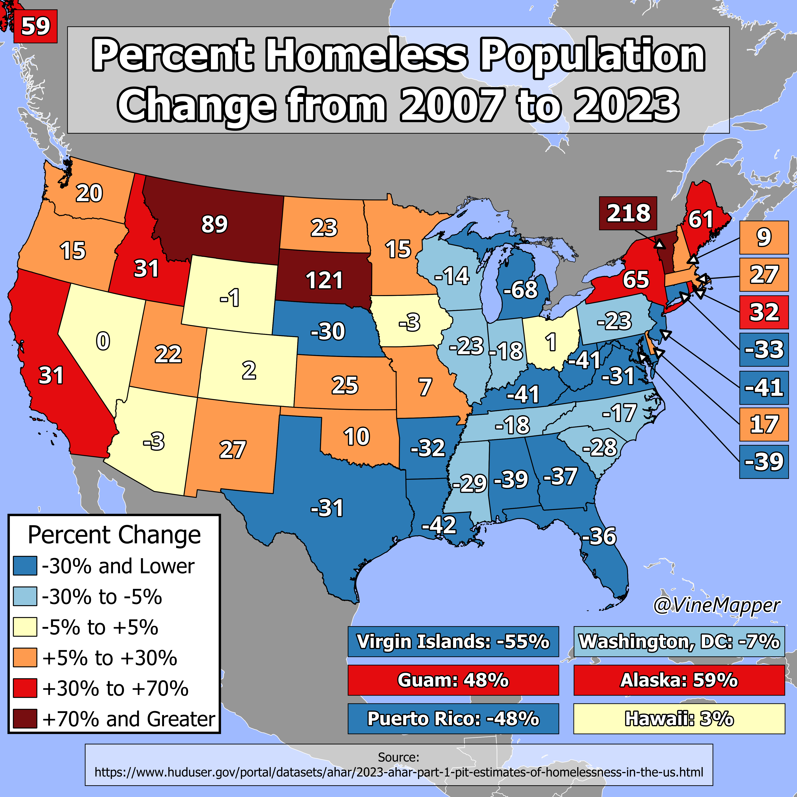

## Homeless Change from 2007 to 2023
A Simple Map showing percent change in homeless population per US State from 2007 to 2023

## Data
* [US Homeless Data](https://www.huduser.gov/portal/datasets/ahar/2023-ahar-part-1-pit-estimates-of-homelessness-in-the-us.html)
* [State Population Totals](https://www.census.gov/data/tables/time-series/demo/popest/2020s-state-total.html)
* [State Boundaries](https://www.census.gov/geographies/mapping-files/time-series/geo/carto-boundary-file.html)
* [Great Lakes](https://usicecenter.gov/Products/GreatLakesData)

## Code
* [Jupyter Notebook](FormatData.ipynb)

## Posts
- [ ] [Tiktok]()
- [ ] [Instagram]()
- [ ] [Instagram Reels]()
- [ ] [Threads]()
- [ ] [Youtube Shorts]()
- [ ] [BlueSky]()
- [ ] [Reddit r/Maps]()
- [ ] [Reddit r/MapPorn]()
