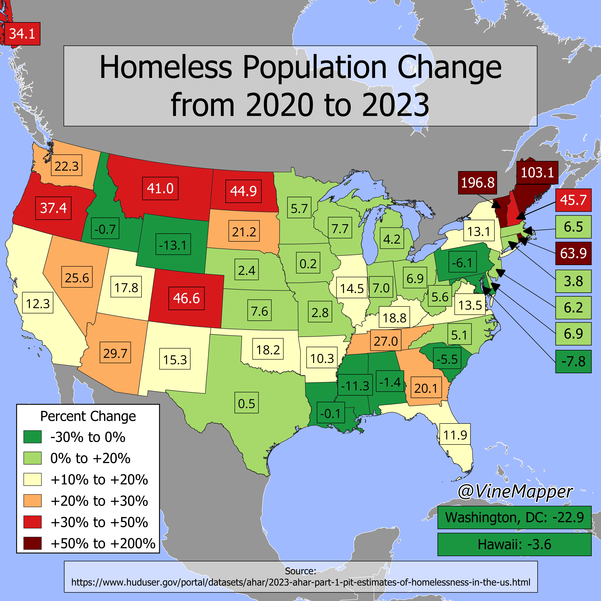

## Homeless Change from 2020 to 2023
A Simple Map showing percent change in homeless population per US State

## Data
* [US Homeless Data](https://www.huduser.gov/portal/datasets/ahar/2023-ahar-part-1-pit-estimates-of-homelessness-in-the-us.html)
* [State Population Totals](https://www.census.gov/data/tables/time-series/demo/popest/2020s-state-total.html)
* [State Boundaries](https://www.census.gov/geographies/mapping-files/time-series/geo/carto-boundary-file.html)
* [Great Lakes](https://usicecenter.gov/Products/GreatLakesData)

## Code
* [Jupyter Notebook](FormatData.ipynb)

## Posts
- [x] [Tiktok](https://www.tiktok.com/@vinemapper/video/7441416875336174894)
- [x] [Instagram](https://www.instagram.com/p/DC195gHSKO1/)
- [x] [Instagram Reels](https://www.instagram.com/reel/DC2RSH8zNo0/)
- [x] [Threads](https://www.threads.net/@vinemapper/post/DC196HOyNKL?xmt=AQGzQpk_gvmbUSr4dYjdWplNF7ErDNk5e1WYRDbGT-PAvQ)
- [x] [Youtube Shorts](https://youtube.com/shorts/hL9zJjwmb3E)
- [x] [BlueSky](https://bsky.app/profile/vinemapper.bsky.social/post/3lbulerhjds2d)
- [x] [Reddit r/Maps](https://www.reddit.com/r/Maps/hot/)
- [x] [Reddit r/MapPorn](https://www.reddit.com/r/MapPorn/comments/1h0gohn/percent_homeless_population_change_from_2020_to/)
