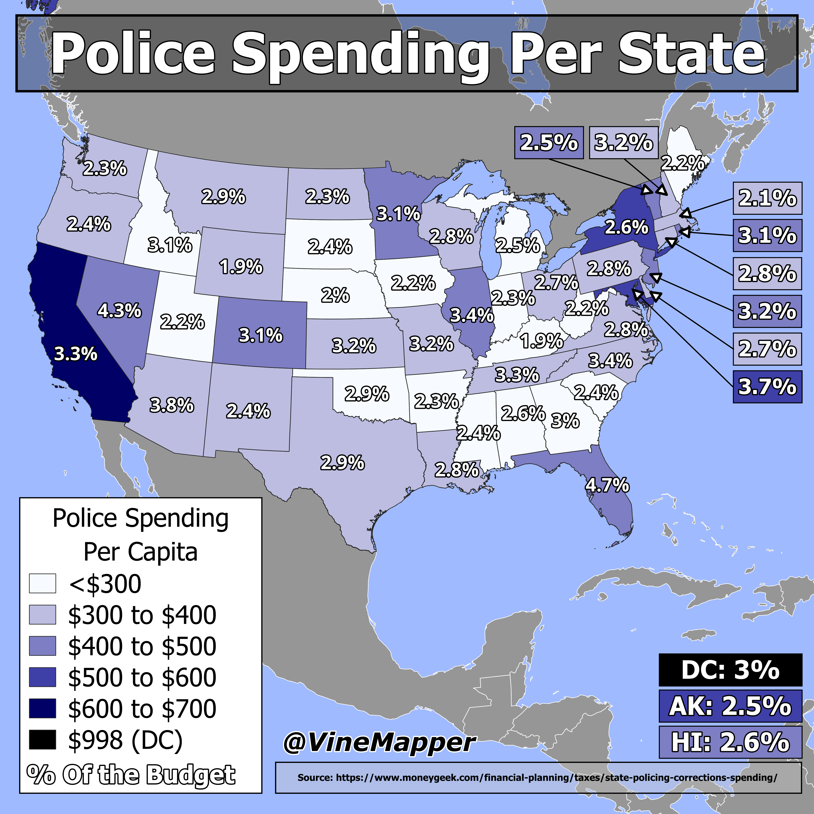

## Police Spending Per State
A Simple Map showing percent of state spending on Policing and amount per capita

## Data
* [Police Data](https://www.moneygeek.com/financial-planning/taxes/state-policing-corrections-spending/)
* [State Boundaries](https://www.census.gov/geographies/mapping-files/time-series/geo/carto-boundary-file.html)
* [Great Lakes](https://usicecenter.gov/Products/GreatLakesData)
* [World GeoJSON](https://public.opendatasoft.com/explore/dataset/world-administrative-boundaries/export/?flg=en-us)

## Code
* [Jupyter Notebook](FormatData.ipynb)

## Posts
- [ ] [Tiktok]()
- [ ] [Instagram]()
- [ ] [Threads]()
- [x] [Youtube Shorts](https://youtube.com/shorts/1FAP_p_2YAo)
- [ ] [BlueSky]()
- [ ] [Reddit r/Maps]()
- [ ] [Reddit r/MapPorn]()
