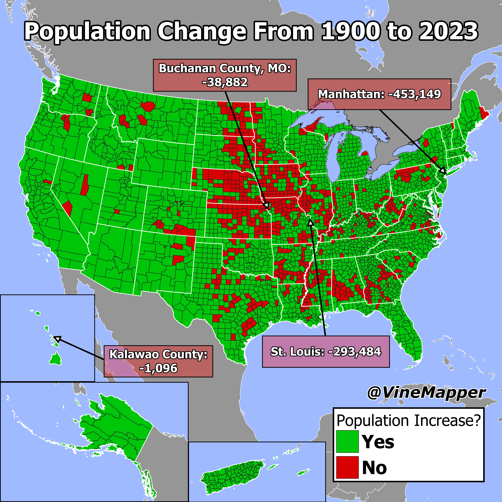

## Population Change from 1900 to 2023
A Simple Map showing if a county has increased in population from 1900 to 2023

## Data
* [1900 Census](https://www.nber.org/research/data/census-us-decennial-county-population-data-1900-1990)
* [2023 County Population Totals](https://www2.census.gov/programs-surveys/popest/datasets/2020-2023/counties/totals/)
* [State Boundaries](https://www.census.gov/geographies/mapping-files/time-series/geo/carto-boundary-file.html)
* [Great Lakes](https://usicecenter.gov/Products/GreatLakesData)
* [World GeoJSON](https://public.opendatasoft.com/explore/dataset/world-administrative-boundaries/export/?flg=en-us)

## Code
* [Jupyter Notebook](FormatData.ipynb)

## Posts
- [ ] [Tiktok]()
- [ ] [Instagram]()
- [ ] [Instagram Reels]()
- [ ] [Threads]()
- [ ] [Youtube Shorts]()
- [ ] [BlueSky]()
- [ ] [Reddit r/Maps]()
- [ ] [Reddit r/MapPorn]()
