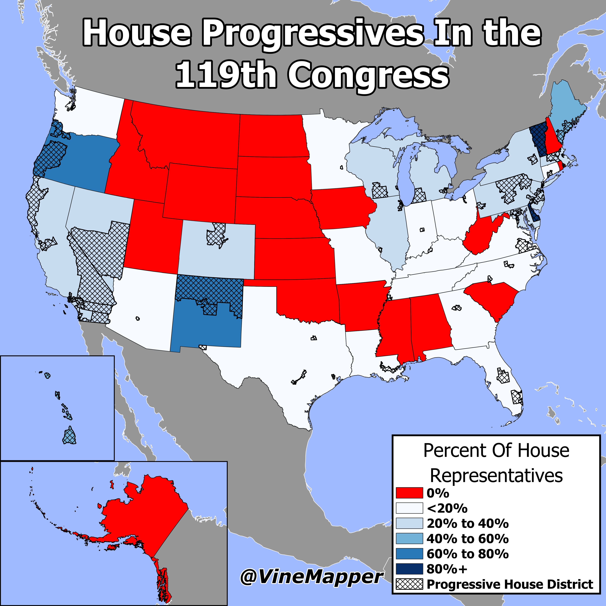

## Progressive House Members in the 119th Congress
A Simple Map showing the percent of progressive House Members per state and progressive districts.

## Data
* [Progressive Data](https://en.wikipedia.org/wiki/Congressional_Progressive_Caucus)
* [Congressional Boundaries](https://www.census.gov/geographies/mapping-files/time-series/geo/carto-boundary-file.html)
* [State Boundaries](https://www.census.gov/geographies/mapping-files/time-series/geo/carto-boundary-file.html)
* [Great Lakes](https://usicecenter.gov/Products/GreatLakesData)
* [World GeoJSON](https://public.opendatasoft.com/explore/dataset/world-administrative-boundaries/export/?flg=en-us)

## Code
* [Jupyter Notebook](FormatData.ipynb)

## Posts
- [x] [Tiktok](https://www.tiktok.com/@vinemapper/video/7446905863073271083)
- [x] [Instagram](https://www.instagram.com/p/DDm5lc3SAt2/)
- [x] [Instagram Reels](https://www.instagram.com/p/DDm50bHyVcP/)
- [x] [Threads](https://www.threads.net/@vinemapper/post/DDm5l6Qyu1w)
- [x] [Youtube Shorts](https://youtube.com/shorts/qogB88Z3e2Y)
- [x] [Twitter/X](https://x.com/VineMapper/status/1868350481178980576)
- [x] [BlueSky](https://bsky.app/profile/vinemapper.bsky.social/post/3ldeeal5s4224)
- [x] [Reddit r/Maps](https://www.reddit.com/r/Maps/comments/1hexts0/house_progressives_in_the_119th_congress/)
- [x] [Reddit r/MapPorn](https://www.reddit.com/r/MapPorn/comments/1hextdd/house_progressives_in_the_119th_congress/)
