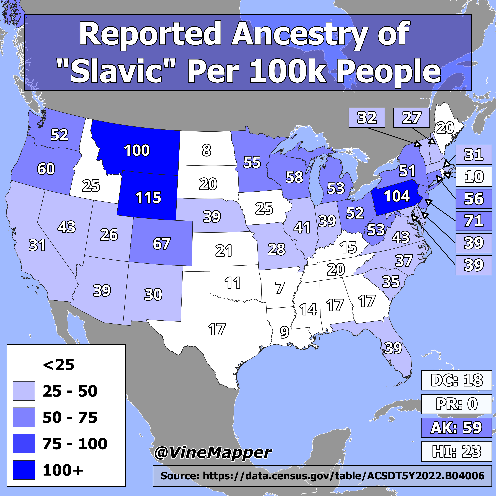

## Slavs In the USA
A Simple Map showing the number of Slavs per 100k people

## Data
* [Ethnic Data](https://data.census.gov/table/ACSDT5Y2022.B04006?q=People%20Reporting%20Ancestry&g=010XX00US$0400000)
* [State Boundaries](https://www.census.gov/geographies/mapping-files/time-series/geo/carto-boundary-file.html)
* [Great Lakes](https://usicecenter.gov/Products/GreatLakesData)
* [World GeoJSON](https://public.opendatasoft.com/explore/dataset/world-administrative-boundaries/export/?flg=en-us)

## Code
* [Jupyter Notebook](FormatData.ipynb)

## Posts
- [x] [Tiktok](https://www.tiktok.com/@vinemapper/video/7444735045568335150)
- [x] [Instagram](https://www.instagram.com/p/DDUxmw3P4N1/)
- [x] [Instagram Reels](https://www.instagram.com/reel/DDWCnTxRzEo/)
- [x] [Threads](https://www.threads.net/@vinemapper/post/DDUxnQnPliC)
- [x] [Youtube Shorts](https://www.youtube.com/shorts/Yec-j0ltLCM)
- [x] [BlueSky](https://bsky.app/profile/vinemapper.bsky.social/post/3lcsnwyz2f226)
- [x] [Reddit r/Maps](https://www.reddit.com/r/Maps/comments/1h9mzid/russians_per_10k_people_in_the_usa/)
- [x] [Reddit r/MapPorn](https://www.reddit.com/r/MapPorn/comments/1h9mzrp/russians_per_10k_people_in_the_usa/)
