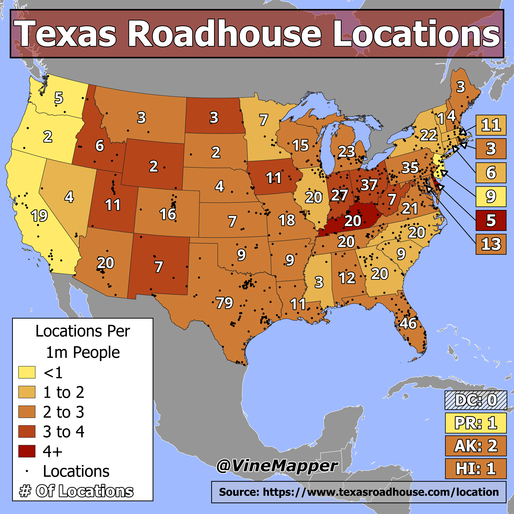

## Texas RoadHouse In The US
A Simple Map showing locations of Each Texas Roadhouse and Stores per 1m People

## Data
* [Texas Roadhouse Data](https://www.texasroadhouse.com/location)
* [State Population Totals](https://www.census.gov/data/tables/time-series/demo/popest/2020s-state-total.html)
* [State Boundaries](https://www.census.gov/geographies/mapping-files/time-series/geo/carto-boundary-file.html)
* [Great Lakes](https://usicecenter.gov/Products/GreatLakesData)
* [World GeoJSON](https://public.opendatasoft.com/explore/dataset/world-administrative-boundaries/export/?flg=en-us)

## Code
* [Jupyter Notebook](FormatData.ipynb)

## Posts
- [x] [Tiktok](https://www.tiktok.com/@vinemapper/video/7446273427465456939)
- [x] [Instagram](https://www.instagram.com/p/DDkRWV3PzTH/)
- [x] [Instagram Reels](https://www.instagram.com/p/DDkQ66CPlAF/)
- [x] [Threads](https://www.threads.net/@vinemapper/post/DDkRXeGvxWJ)
- [x] [Youtube Shorts](https://youtube.com/shorts/JWnGV1zuGNM)
- [x] [BlueSky](https://bsky.app/profile/vinemapper.bsky.social/post/3ldbsc2xjtc2v)
- [x] [Reddit r/Maps](https://www.reddit.com/r/Maps/comments/1he7j5v/texas_roadhouses_per_state/)
- [x] [Reddit r/MapPorn](https://www.reddit.com/r/MapPorn/comments/1he7hrv/texas_roadhouse_locations_in_the_usa/)
- [x] [Reddit r/TexasRoadhouse](https://www.reddit.com/r/TexasRoadhouse/comments/1he7lyi/texas_roadhouse_locations_in_the_usa/)
- [x] [Twitter/X](https://x.com/VineMapper/status/1868126732697604392/photo/1)
