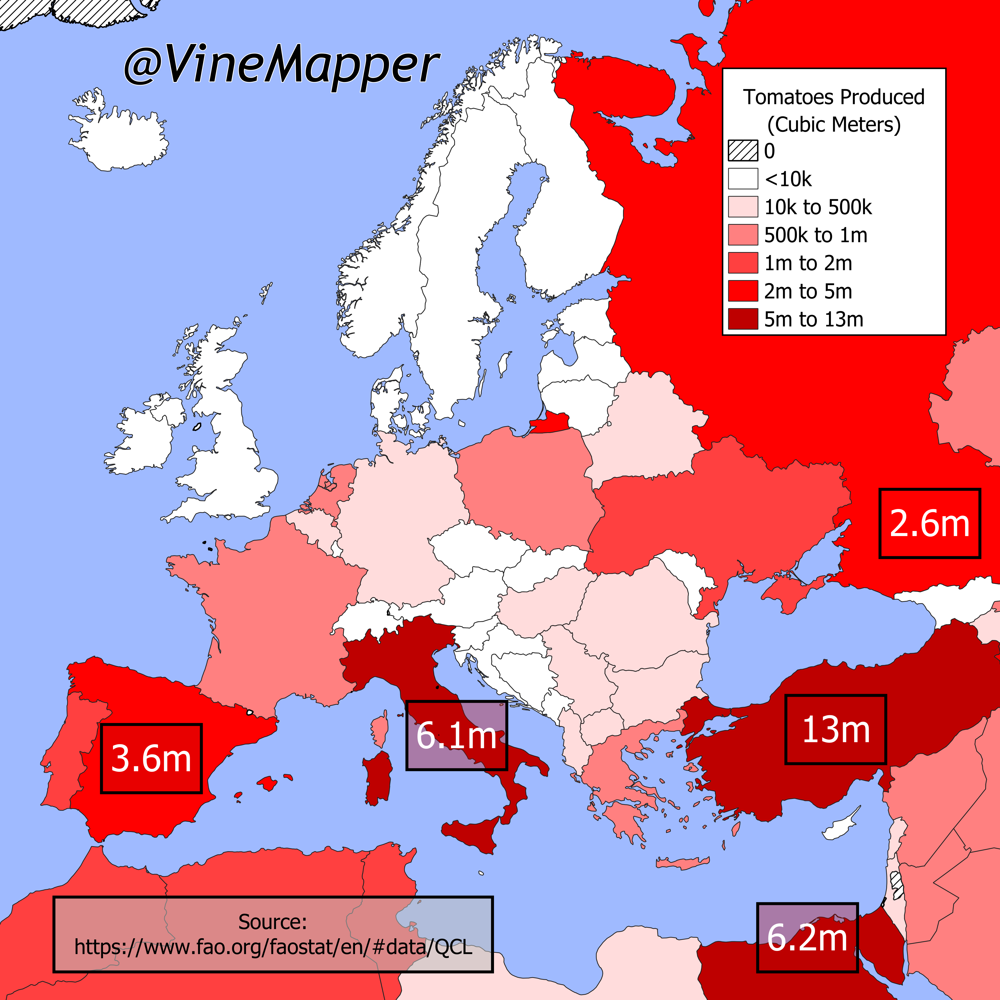

## Tomato Production In Europe 2022
A Simple Map showing volume of tomatoes produced in Europe in 2022

## Data
* [Tomatoes data](https://www.fao.org/faostat/en/#data/QCL)
* [World GeoJSON](https://public.opendatasoft.com/explore/dataset/world-administrative-boundaries/export/?flg=en-us)
* [Caspian Sea](https://cartographyvectors.com/map/1224-caspian-sea)

## Code
* [Jupyter Notebook](FormatData.ipynb)

## Posts
- [ ] [Tiktok]()
- [ ] [Instagram]()
- [ ] [Instagram Reels]()
- [ ] [Threads]()
- [ ] [Youtube Shorts]()
- [ ] [BlueSky]()
- [ ] [Reddit r/Maps]()
- [ ] [Reddit r/MapPorn]()
