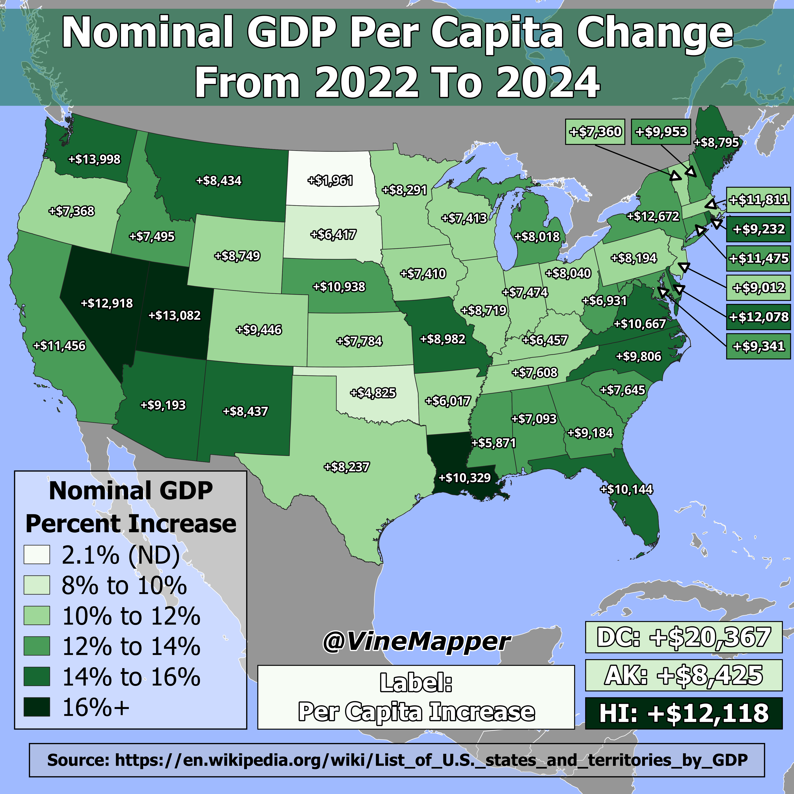

## GDP Change Per State from 2022 to 2024
A Simple Map showing GDP Change Per State from 2022 to 2024

## Data
* [GDP Data](https://en.wikipedia.org/wiki/List_of_U.S._states_and_territories_by_GDP)
* [State Boundaries](https://www.census.gov/geographies/mapping-files/time-series/geo/carto-boundary-file.html)
* [Great Lakes](https://usicecenter.gov/Products/GreatLakesData)
* [World GeoJSON](https://public.opendatasoft.com/explore/dataset/world-administrative-boundaries/export/?flg=en-us)

## Code
* [Jupyter Notebook](FormatData.ipynb)

## Posts
- [x] [Tiktok](https://www.tiktok.com/@vinemapper/video/7448872281163484462)
- [x] [Instagram](https://www.instagram.com/p/DD9-kmlxthi/)
- [x] [Threads](https://www.threads.net/@vinemapper/post/DD9-k8Oxths)
- [x] [Youtube Shorts](https://www.youtube.com/shorts/Dq8RV9xVLUw)
- [x] [X/Twitter](https://x.com/VineMapper/status/1871599138112196982)
- [x] [BlueSky](https://bsky.app/profile/vinemapper.bsky.social/post/3le2vnkq4us24)
- [x] [Reddit r/Maps](https://www.reddit.com/r/Maps/comments/1hlhh0t/gdp_per_capita_changes_per_state_from_2022_to_2024/)
- [x] [Reddit r/MapPorn](https://www.reddit.com/r/MapPorn/comments/1hlhgqg/gdp_per_capita_changes_per_state_from_2022_to_2024/)
