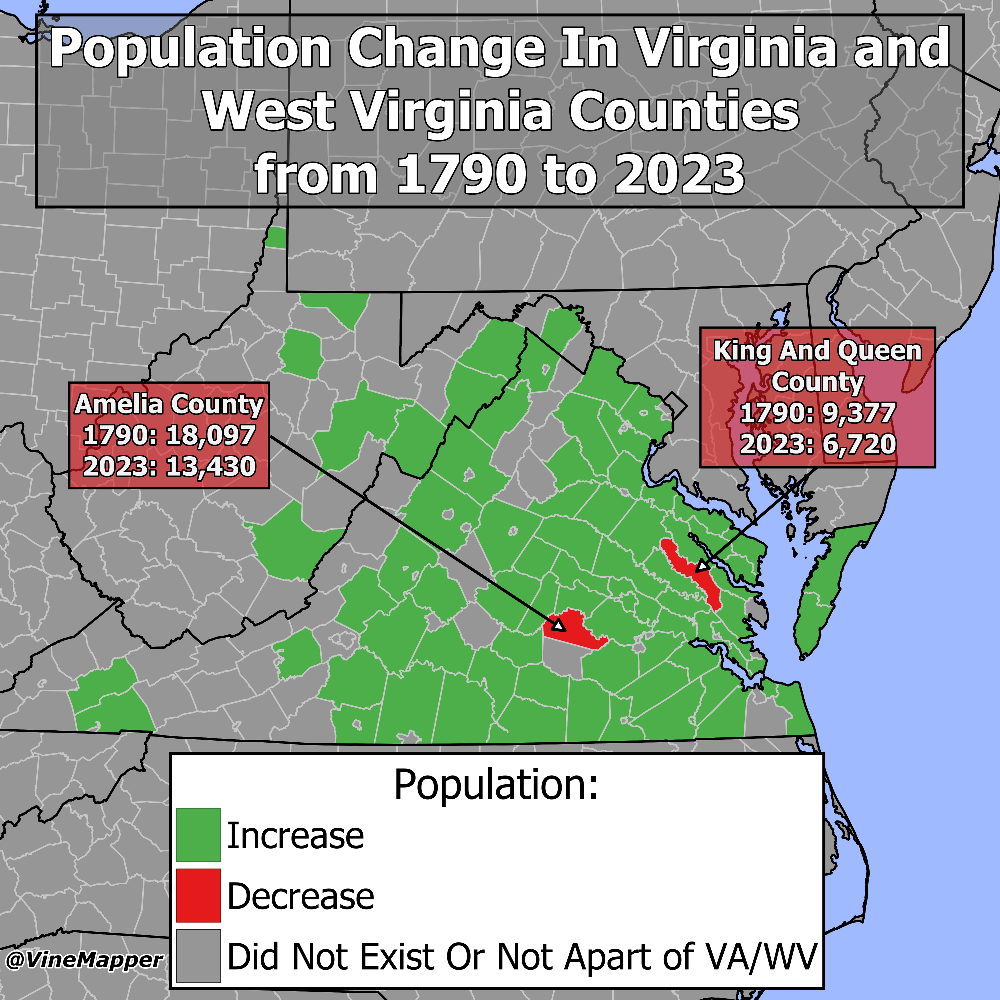

## Virginia Counties Population Change from 1790 to 2023
A Simple Map showing if a county has increased in population from 1790 to 2023

## Data
* [1790 Virginia Population](http://www.virginiaplaces.org/population/pop1790numbers.html)
* [2023 County Population Totals](https://www2.census.gov/programs-surveys/popest/datasets/2020-2023/counties/totals/)
* [County Boundaries](https://www.census.gov/geographies/mapping-files/time-series/geo/carto-boundary-file.html)
* [State Boundaries](https://www.census.gov/geographies/mapping-files/time-series/geo/carto-boundary-file.html)

## Code
* [Jupyter Notebook](FormatData.ipynb)

## Posts
- [x] [Tiktok](https://www.tiktok.com/@vinemapper/video/7444737418118303018)
- [x] [Instagram](https://www.instagram.com/p/DDXYXxaPBSj/)
- [x] [Threads](https://www.threads.net/@vinemapper/post/DDXYY6wPnla)
- [x] [Youtube Shorts](https://youtube.com/shorts/C_FxcruUAoM)
- [x] [BlueSky](https://bsky.app/profile/vinemapper.bsky.social/post/3lcv7kw7on222)
- [x] [Reddit r/Maps](https://www.reddit.com/r/Maps/comments/1haegkh/population_increase_or_decrease_from_1900_to_2023/)
- [x] [Reddit r/MapPorn](https://www.reddit.com/r/MapPorn/comments/1haefun/population_increase_or_decrease_from_1900_to_2023/)
