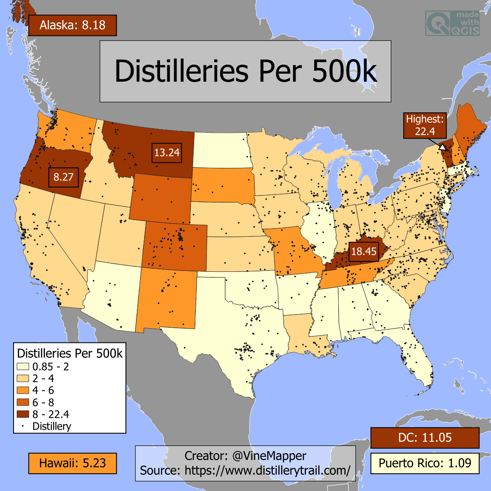

## Distilleries Per 500k
A Simple Map showing the Distilleries per 500k in each US State

## Data
* [Distillery Data](https://www.distillerytrail.com/)
* [State Population Totals](https://www.census.gov/data/tables/time-series/demo/popest/2020s-state-total.html)
* [State Boundaries](https://www.census.gov/geographies/mapping-files/time-series/geo/carto-boundary-file.html)
* [Great Lakes](https://usicecenter.gov/Products/GreatLakesData)
* [World GeoJSON](https://public.opendatasoft.com/explore/dataset/world-administrative-boundaries/export/?flg=en-us)

## Code
* [Jupyter Notebook](FormatData.ipynb)

## Posts
- [x] [Tiktok](https://www.tiktok.com/@vinemapper/video/7441305847994813742)
- [x] [Instagram](https://www.instagram.com/p/DCzopdxzppy/)
- [x] [Instagram Reels](https://www.instagram.com/reel/DCzpc5LTOh1/)
- [x] [Threads](https://www.threads.net/@vinemapper/post/DCzoqEFTQky)
- [x] [Youtube Shorts](https://www.youtube.com/shorts/Lcwxz5rjhKI)
- [x] [BlueSky](https://bsky.app/profile/vinemapper.bsky.social/post/3lbscvpe6uc2v)
- [x] [Reddit r/Maps](https://www.reddit.com/r/Maps/comments/1gzrrga/distilleries_per_500k/)
- [x] [Reddit r/MapPorn](https://www.reddit.com/r/MapPorn/comments/1gzrqr7/distilleries_per_500k/)
- [x] [Reddit r/firewater](https://www.reddit.com/r/firewater/comments/1gzrt2l/distilleries_per_500k/)
