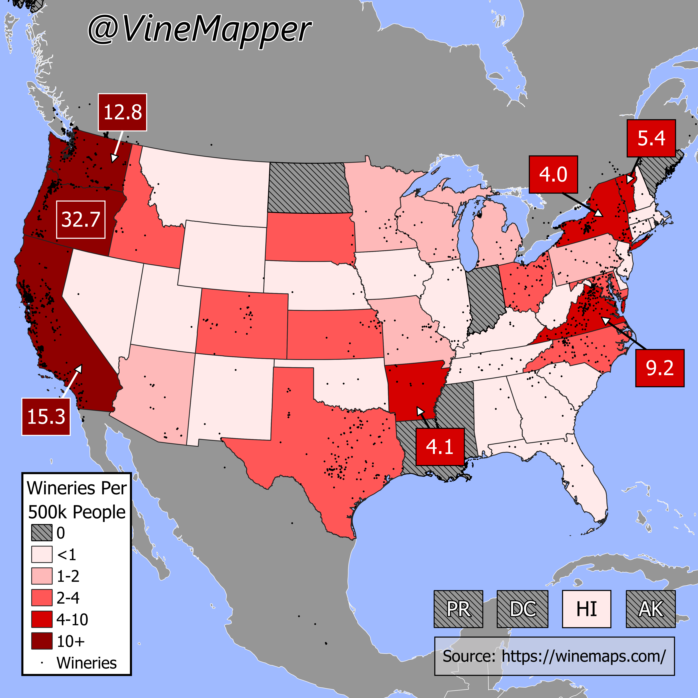

## Wineries Per Capita Per US State
A Simple Map showing the Wineries per 500k in each US State

## Data
* [Wineries](https://winemaps.com/api/wine-maps-winery)
* [State Population Totals](https://www.census.gov/data/tables/time-series/demo/popest/2020s-state-total.html)
* [State Boundaries](https://www.census.gov/geographies/mapping-files/time-series/geo/carto-boundary-file.html)
* [Great Lakes](https://usicecenter.gov/Products/GreatLakesData)

## Code
* [Jupyter Notebook](FormatData.ipynb)

## Posts
- [x] [Tiktok](https://www.tiktok.com/@vinemapper/video/7441834675628281131)
- [x] [Instagram](https://www.instagram.com/p/DDAhtrczbYS/)
- [ ] [Instagram Reels]()
- [x] [Threads](https://www.threads.net/@vinemapper/post/DDAhuOYz6Uw)
- [ ] [Youtube Shorts]()
- [x] [BlueSky](https://bsky.app/profile/vinemapper.bsky.social/post/3lc6vdzajmk26)
- [x] [Reddit r/Maps](https://www.reddit.com/r/Maps/comments/1h3hdcy/wineries_per_500k/)
- [x] [Reddit r/MapPorn](https://www.reddit.com/r/MapPorn/comments/1h3hcut/wineries_per_500k_people/)
- [x] [Reddit r/Wine](https://www.reddit.com/r/wine/comments/1h3l2w2/wineries_per_500k_people/)
- [x] [Reddit r/WineMaking](https://www.reddit.com/r/winemaking/comments/1h3hee2/wineries_per_500k_people/)
