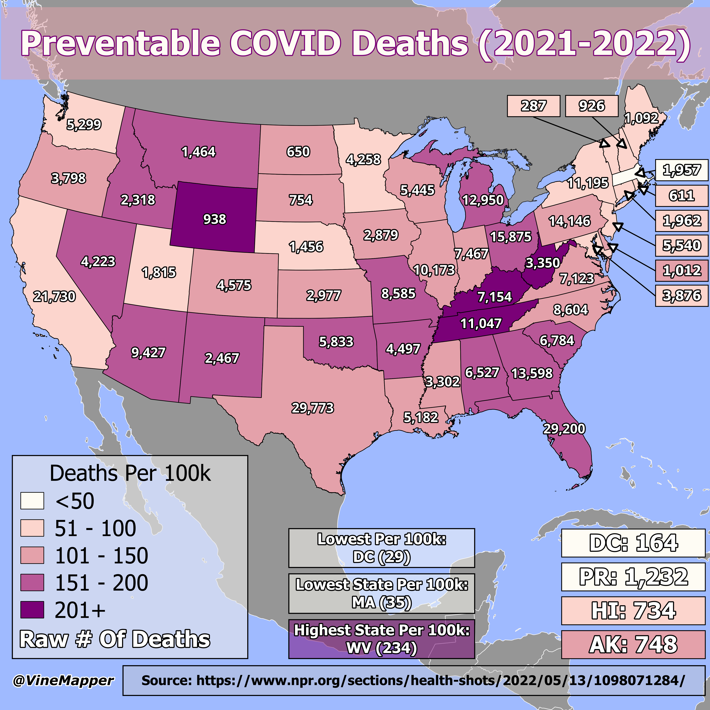

## Preventable COVID Deaths (2021-2022)
A Simple Map showing the raw number of preventable deaths and the per 100k deaths

## Data
* [COVID Data](https://www.npr.org/sections/health-shots/2022/05/13/1098071284/this-is-how-many-lives-could-have-been-saved-with-covid-vaccinations-in-each-sta)
* [State Boundaries](https://www.census.gov/geographies/mapping-files/time-series/geo/carto-boundary-file.html)
* [Great Lakes](https://usicecenter.gov/Products/GreatLakesData)
* [World GeoJSON](https://public.opendatasoft.com/explore/dataset/world-administrative-boundaries/export/?flg=en-us)

## Code
* [Jupyter Notebook](FormatData.ipynb)

## Posts
- [ ] [Tiktok]()
- [ ] [Instagram]()
- [ ] [Instagram Reels]()
- [ ] [Threads]()
- [ ] [Youtube Shorts]()
- [ ] [BlueSky]()
- [ ] [Reddit r/Maps]()
- [ ] [Reddit r/MapPorn]()
