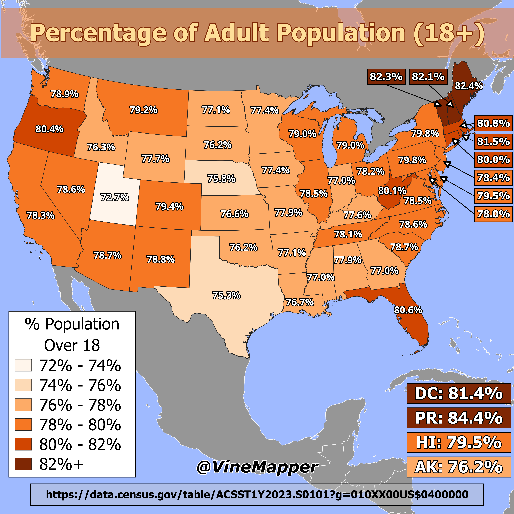

## Percent Of the Population Aged 18+
A Simple Map showing percent of the population that is over 18 years old

## Data
* [Population Data](https://data.census.gov/table/ACSST1Y2023.S0101?g=010XX00US$0400000)
* [State Boundaries](https://www.census.gov/geographies/mapping-files/time-series/geo/carto-boundary-file.html)
* [Great Lakes](https://usicecenter.gov/Products/GreatLakesData)
* [World GeoJSON](https://public.opendatasoft.com/explore/dataset/world-administrative-boundaries/export/?flg=en-us)

## Code
* [Jupyter Notebook](FormatData.ipynb)

## Posts
- [x] [Tiktok](https://www.tiktok.com/@vinemapper/video/7455889117641985323)
- [x] [Instagram](https://www.instagram.com/p/DEakJPxSUiz/)
- [ ] [Instagram Reels]()
- [x] [Threads](https://www.threads.net/@vinemapper/post/DEakJycS4j6)
- [x] [Youtube Shorts](https://youtube.com/shorts/kny1hKQOBsI)
- [x] [X/Twitter](https://x.com/VineMapper/status/1875622497925894558)
- [x] [BlueSky](https://bsky.app/profile/vinemapper.bsky.social/post/3lewsvx774224)
- [x] [Reddit r/Maps](https://www.reddit.com/r/Maps/comments/1htluvm/percentage_of_adult_population_2023/)
- [x] [Reddit r/MapPorn](https://www.reddit.com/r/MapPorn/comments/1htluj0/percentage_of_adult_population_2023/)
