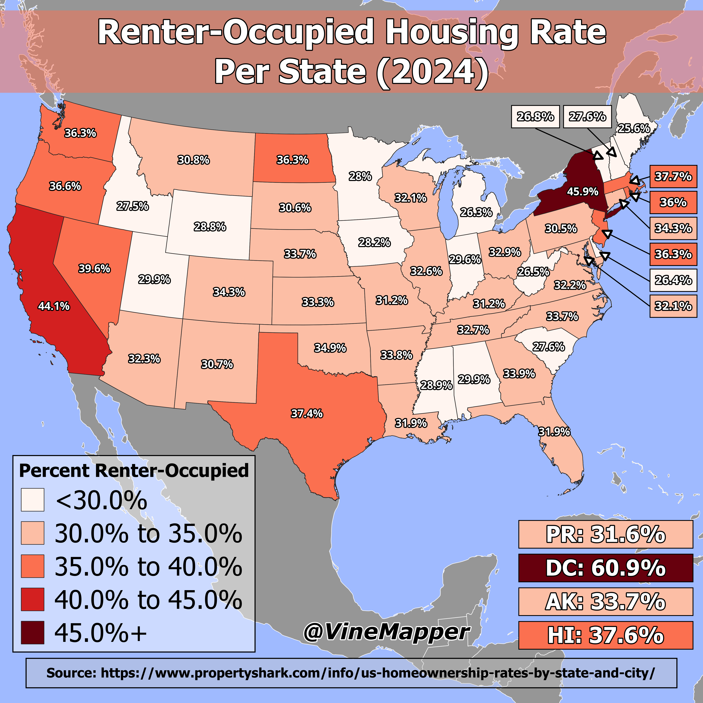

## Renter-Occupied Housing Rate in USA Per State (2024)
A Simple Map showing the renter-occupied housing rate per state in 2024

## Data
* [Homeownership Data](https://www.propertyshark.com/info/us-homeownership-rates-by-state-and-city/)
* [State Boundaries](https://www.census.gov/geographies/mapping-files/time-series/geo/carto-boundary-file.html)
* [Great Lakes](https://usicecenter.gov/Products/GreatLakesData)
* [World GeoJSON](https://public.opendatasoft.com/explore/dataset/world-administrative-boundaries/export/?flg=en-us)

## Code
* [Jupyter Notebook](FormatData.ipynb)

## Posts
- [ ] [Tiktok]()
- [ ] [Instagram]()
- [ ] [Threads]()
- [ ] [Youtube Shorts]()
- [ ] [X/Twitter]()
- [ ] [BlueSky]()
- [ ] [Reddit r/Maps]()
- [ ] [Reddit r/MapPorn]()
