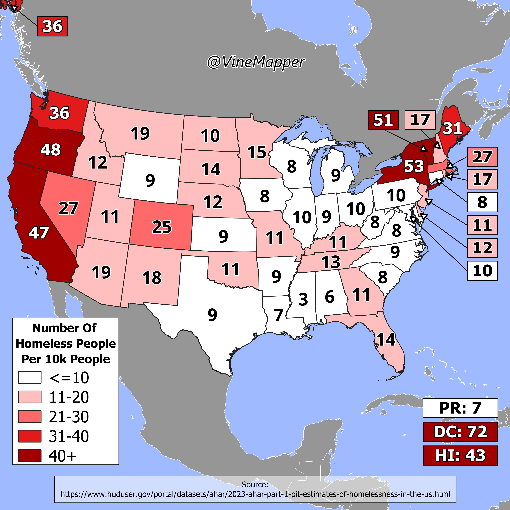

## Homeless Population Out of 10k
A Simple Map showing percent homeless population out of 10k

## Data
* [US Homeless Data](https://www.huduser.gov/portal/datasets/ahar/2023-ahar-part-1-pit-estimates-of-homelessness-in-the-us.html)
* [State Population Totals](https://www.census.gov/data/tables/time-series/demo/popest/2020s-state-total.html)
* [State Boundaries](https://www.census.gov/geographies/mapping-files/time-series/geo/carto-boundary-file.html)
* [Great Lakes](https://usicecenter.gov/Products/GreatLakesData)

## Code
* [Jupyter Notebook](FormatData.ipynb)

## Posts
- [x] [Tiktok](https://www.tiktok.com/@vinemapper/video/7441818411233004843)
- [x] [Instagram](https://www.instagram.com/p/DC5Aoyxz31b/)
- [x] [Instagram Reels](https://www.instagram.com/reel/DC50eo_R2LP/)
- [x] [Threads](https://www.threads.net/@vinemapper/post/DC5ApwNTQrG)
- [x] [Youtube Shorts](https://www.youtube.com/shorts/YdvXspoah7Q)
- [x] [BlueSky](https://bsky.app/profile/vinemapper.bsky.social/post/3lbxrvn6m4226)
- [x] [Reddit r/Maps](https://www.reddit.com/r/MapPorn/comments/1h19miq/number_of_homeless_people_per_10k_people_2023/)
- [x] [Reddit r/MapPorn](https://www.reddit.com/r/Maps/comments/1h19oqn/number_of_homeless_people_per_10k_2023/)
