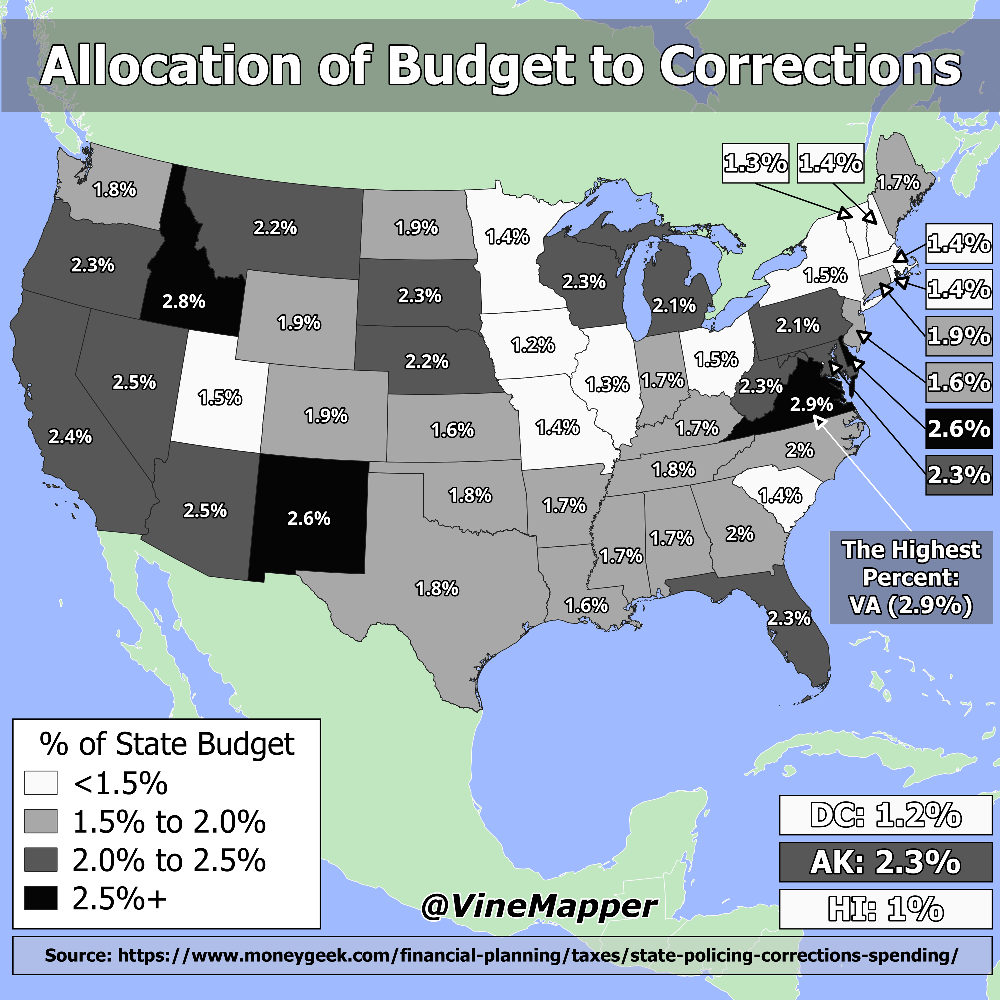

## Corrections Spending Per State Inversed
A Simple Map showing percent of state spending on corrections and amount per capita inversed from [Corrections_Spending_Per_Capita](../Corrections_Spending_Per_Capita/)

## Data
* [Corrections Data](https://www.moneygeek.com/financial-planning/taxes/state-policing-corrections-spending/)
* [State Boundaries](https://www.census.gov/geographies/mapping-files/time-series/geo/carto-boundary-file.html)
* [Great Lakes](https://usicecenter.gov/Products/GreatLakesData)
* [World GeoJSON](https://public.opendatasoft.com/explore/dataset/world-administrative-boundaries/export/?flg=en-us)

## Code
* [Jupyter Notebook](FormatData.ipynb)

## Posts
- [x] [Tiktok](https://www.tiktok.com/@vinemapper/video/7449200322930576683)
- [x] [Instagram](https://www.instagram.com/p/DEDKqRHxknY/)
- [x] [Threads](https://www.threads.net/@vinemapper/post/DEDKrN0xKcI)
- [x] [Youtube Shorts](https://www.youtube.com/shorts/SxM6q09-b0I)
- [x] [BlueSky](https://bsky.app/profile/vinemapper.bsky.social/post/3le7xsbdtts2p)
- [x] [X/Twitter](https://x.com/VineMapper/status/1872329392283894073)
- [x] [Reddit r/Maps](https://www.reddit.com/r/Maps/comments/1hmssfh/allocation_of_state_budgets_to_corrections_2021/)
- [x] [Reddit r/MapPorn](https://www.reddit.com/r/MapPorn/comments/1hmsstu/allocation_of_state_budgets_to_corrections_2021/)
