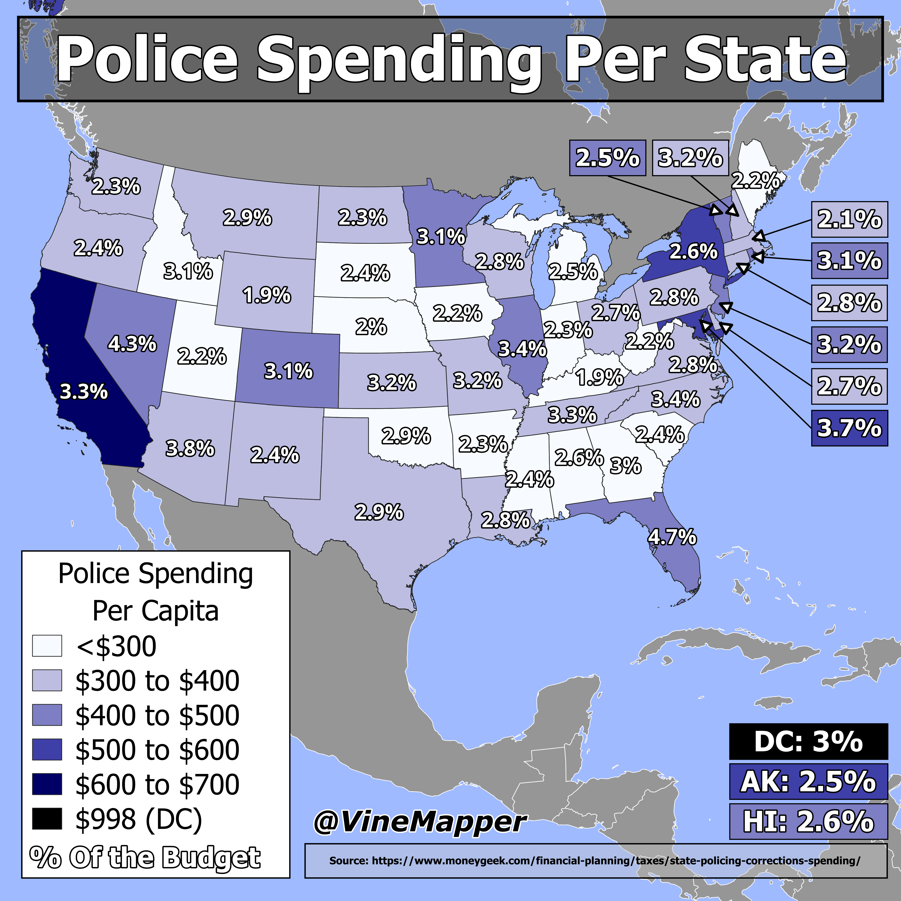

## Police Spending Per State
A Simple Map showing percent of state spending on Policing and amount per capita

## Data
* [Police Data](https://www.moneygeek.com/financial-planning/taxes/state-policing-corrections-spending/)
* [State Boundaries](https://www.census.gov/geographies/mapping-files/time-series/geo/carto-boundary-file.html)
* [Great Lakes](https://usicecenter.gov/Products/GreatLakesData)
* [World GeoJSON](https://public.opendatasoft.com/explore/dataset/world-administrative-boundaries/export/?flg=en-us)

## Code
* [Jupyter Notebook](FormatData.ipynb)

## Posts
- [x] [Tiktok](https://www.tiktok.com/@vinemapper/video/7448864038211046699)
- [x] [Instagram](https://www.instagram.com/p/DDpex1VySSA/)
- [x] [Threads](https://www.threads.net/@vinemapper/post/DDpeysCSTZg)
- [x] [Youtube Shorts](https://youtube.com/shorts/1FAP_p_2YAo)
- [x] [BlueSky](https://bsky.app/profile/vinemapper.bsky.social/post/3ldgv6ulx622e)
- [x] [Twitter/X](https://x.com/VineMapper/status/1868714585852895661)
- [x] [Reddit r/Maps](https://www.reddit.com/r/Maps/comments/1hforvv/police_spending_by_state/)
- [x] [Reddit r/MapPorn](https://www.reddit.com/r/MapPorn/comments/1hforkw/police_spending_by_state/)
