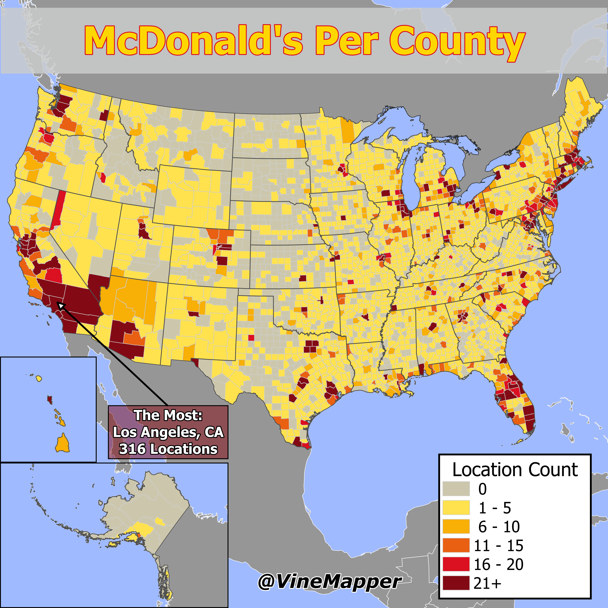

## McDonald's Count In Each County in the USA
A Simple Map showing the count of McDonald's in each US County

## Data
* [McDonalds Data, check other McDonald's Map. Webscrapping takes ~10h](../McDonalds_Per_State/)
* [State Boundaries](https://www.census.gov/geographies/mapping-files/time-series/geo/carto-boundary-file.html)
* [County Data](https://www.census.gov/geographies/mapping-files/time-series/geo/carto-boundary-file.html)
* [Great Lakes](https://usicecenter.gov/Products/GreatLakesData)
* [World GeoJSON](https://public.opendatasoft.com/explore/dataset/world-administrative-boundaries/export/?flg=en-us)

## Code
* [Jupyter Notebook](FormatData.ipynb)

## Posts
- [x] [Tiktok](https://www.tiktok.com/@vinemapper/video/7456852806117362990)
- [x] [Instagram](https://www.instagram.com/p/DEfe6n8PzO4/)
- [ ] [Instagram Reels]()
- [x] [Threads](https://www.threads.net/@vinemapper/post/DEfe7X7P9bl)
- [x] [Youtube Shorts](https://youtube.com/shorts/W-OaEluLXPM)
- [x] [BlueSky](https://bsky.app/profile/vinemapper.bsky.social/post/3lf3mlnv3i222)
- [x] [X/Twitter](https://x.com/VineMapper/status/1876314068203840003)
- [x] [Reddit r/Maps](https://www.reddit.com/r/Maps/comments/1hv3v89/mcdonalds_per_county/)
- [x] [Reddit r/MapPorn](https://www.reddit.com/r/MapPorn/comments/1hv3ur6/mcdonalds_per_county/)
