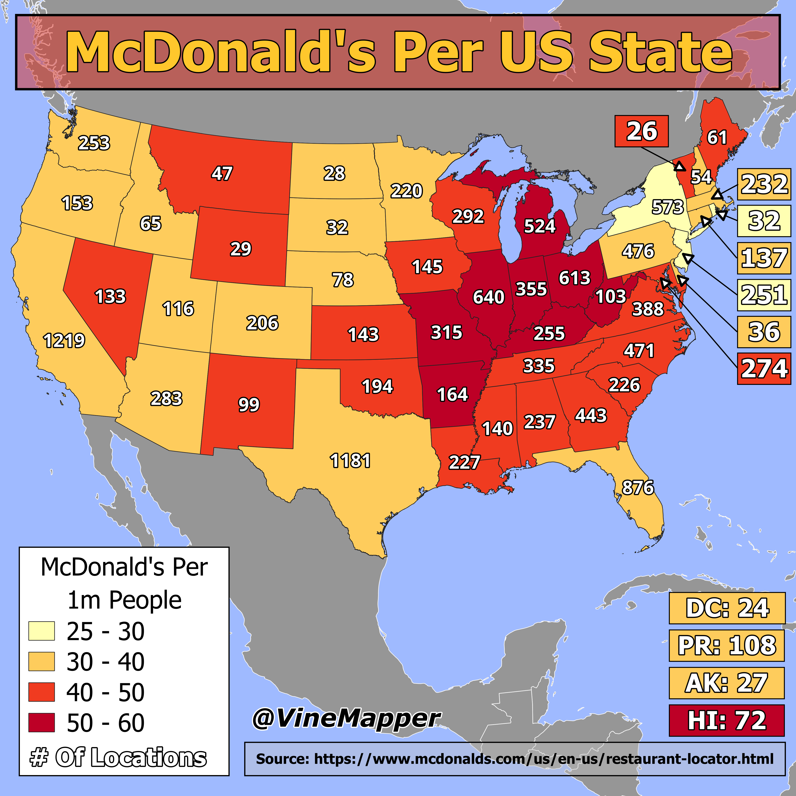

## McDonald's Per State
A Simple Map showing McDonald's Per State

## Data
* [McDonalds Data](https://www.mcdonalds.com/us/en-us/restaurant-locator.html)
* [State Population Totals](https://www.census.gov/data/tables/time-series/demo/popest/2020s-state-total.html)
* [State Boundaries](https://www.census.gov/geographies/mapping-files/time-series/geo/carto-boundary-file.html)
* [County Data](https://www.census.gov/geographies/mapping-files/time-series/geo/carto-boundary-file.html)
* [Great Lakes](https://usicecenter.gov/Products/GreatLakesData)
* [World GeoJSON](https://public.opendatasoft.com/explore/dataset/world-administrative-boundaries/export/?flg=en-us)

## Code
* [Jupyter Notebook](FormatData.ipynb)

## Posts
- [x] [Tiktok](https://www.tiktok.com/@vinemapper/video/7446914537783282990)
- [x] [Instagram](https://www.instagram.com/p/DDxLMPXxFWo/)
- [x] [Threads](https://www.threads.net/@vinemapper/post/DDxLNamR-Zw)
- [x] [Youtube Shorts](https://youtube.com/shorts/I0s_ogh3K3I)
- [x] [X/Twitter](https://x.com/VineMapper/status/1869795203768562046)
- [x] [BlueSky](https://bsky.app/profile/vinemapper.bsky.social/post/3ldof2z47ds2z)
- [x] [Reddit r/Maps](https://www.reddit.com/r/Maps/comments/1hhxeu6/mcdonalds_per_state_2024/)
- [x] [Reddit r/MapPorn](https://www.reddit.com/r/MapPorn/comments/1hhxerp/mcdonalds_per_state_2024/)
